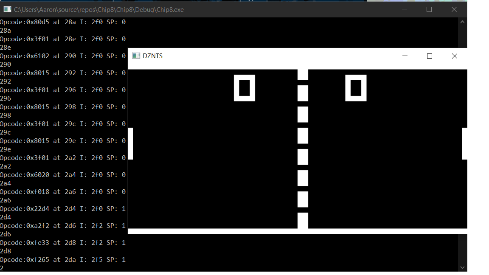

# Chip8Interpreter
A CHIP8 interpreter written in C++.  
This interpreter is based off of Laurence Muller's tutorial for building a CHIP8 emulator.  

I created this program in sophomore year for learning purposes (getting better at C++).I also was very interested in how emulators worked and computer architecture, so this was a great project to learn from.  
As of right now, I am using the same code as Muller to display the output onto a separate window using FreeGLUT(which is a library of utilities using OpenGL that allow the user to create a new window and do system level I/O), since I wasn't too interested in learning how to use the OpenGL API. The code works for displaying a game, but later revisions would be needed in order to make the interpreter more playable. Later on, I will make my own file for displaying output(maybe using SDL2.0 or SFML, leaning towards SFML as of right now, but not decided since I am currently brushing up on my C/C++ skills). I might also expand on this interpreter by integrating sound into the emulator using SFML or SDL2.0.  SDL2.0 or SFML is a library that will make it easier for me to use OpenGL. I would also need it to track keyboard presses and implement sound if I need to later on.

Full credit to Laurence Muller for the OpenGL code.  
You can view the tutorial at: http://www.multigesture.net/articles/how-to-write-an-emulator-chip-8-interpreter/  

Some other helpful links that I used in order to create this emulator are also in the CHIP.cpp file that I included, but for convenience, will also be provided here:

/*  
HELPFUL LINKS  
*https://en.wikipedia.org/wiki/CHIP-8#Virtual_machine_description  
*http://www.multigesture.net/articles/how-to-write-an-emulator-chip-8-interpreter/  
*http://www.cs.columbia.edu/~sedwards/classes/2016/4840-spring/designs/Chip8.pdf  
*http://devernay.free.fr/hacks/chip8/C8TECH10.HTM#dispcoords  
http://emubook.emulation64.com/cpu.htm  
https://www.cise.ufl.edu/~mssz/CompOrg/CDA-proc.html  
http://www.emulator101.com/chip-8-emulator.html  
https://erg.abdn.ac.uk/users/gorry/eg2068/course/dispatch.html  
http://mattmik.com/files/chip8/mastering/chip8.html  
-The starred links are some of the main websites I used to refer back to, especially in the beginning
-Some of the links are very repetitive, especially with the specs of the CHIP-8, but there are some extra tidbits of information that were important
from every link.  
-I also used Horowitz's "The Art of Electronics" as a really good way of referring back for information that I needed(not specifically
for the CHIP8 system, but just a bit of background reading before I try to go further with the project).
*/  

  

  

As of right now, the emulator is working to the point where it is playable. However, there are issues with the emulator due to timing (the delay and sound timers are supposed to decrement at a rate of 60 Hz, but for some reason, it seems to be decrementing much faster than that).  
As of right now, my main priority is to:  
1) Start using SDL to do the outputting of graphics, user input and sound.  
2) Focus on the timing issues of the emulator (not to the point where it is cycle accurate, but I want the emulator to be playable at least for half of the ROMs that are currently out there).  
3) Focus on updating the language I am using to modern C++ (this is not important, but is a part of me learning C++).
